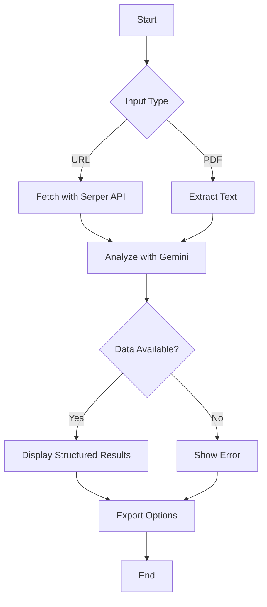
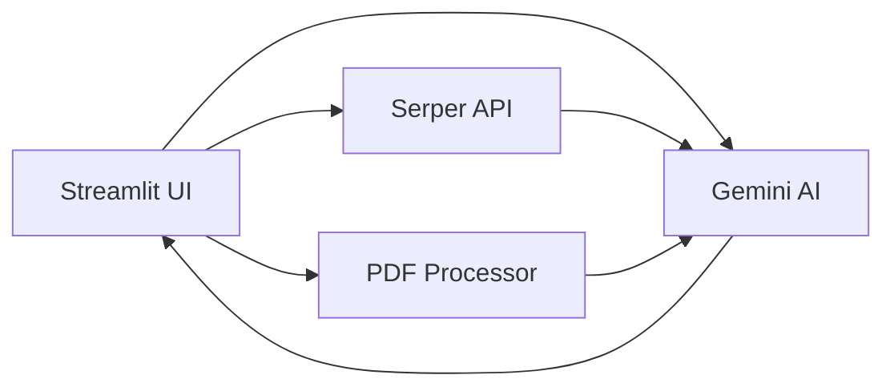
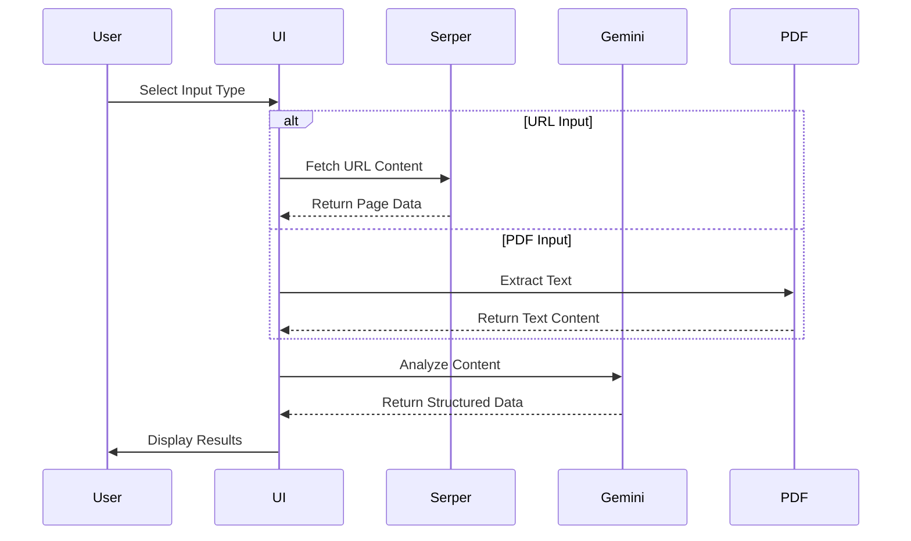

# Credit Card Information Extractor 📊💳

[](https://raw.githubusercontent.com/your-repo/credit-card-extractor/main/README.md)

## Flow Chart 📈



## System Architecture 🏗️



## Complete Setup Guide 🛠️

### 1. Environment Setup

```bash
# Clone repository
git clone https://github.com/your-repo/credit-card-extractor.git
cd credit-card-extractor

# Create virtual environment
python -m venv venv
source venv/bin/activate  # Linux/Mac
venv\Scripts\activate    # Windows
```

### 2. Installation

```bash
pip install -r requirements.txt
```

### 3. Configuration

Create `.env` file:

```ini
GEMINI_API_KEY=your_actual_key_here
SERPER_API_KEY=your_actual_key_here
```

### 4. Execution Flow



# To run
```python
streamlit run app.py
```

## Troubleshooting 🔧

| Error | Solution |
|-------|----------|
| API Limits | Upgrade Serper/Gemini plan |
| PDF Errors | Use text-based PDFs |
| Model Not Found | Check available Gemini models |

## License 📜

MIT License - Contains [Mermaid.js](https://mermaid.js.org/) diagrams

---

